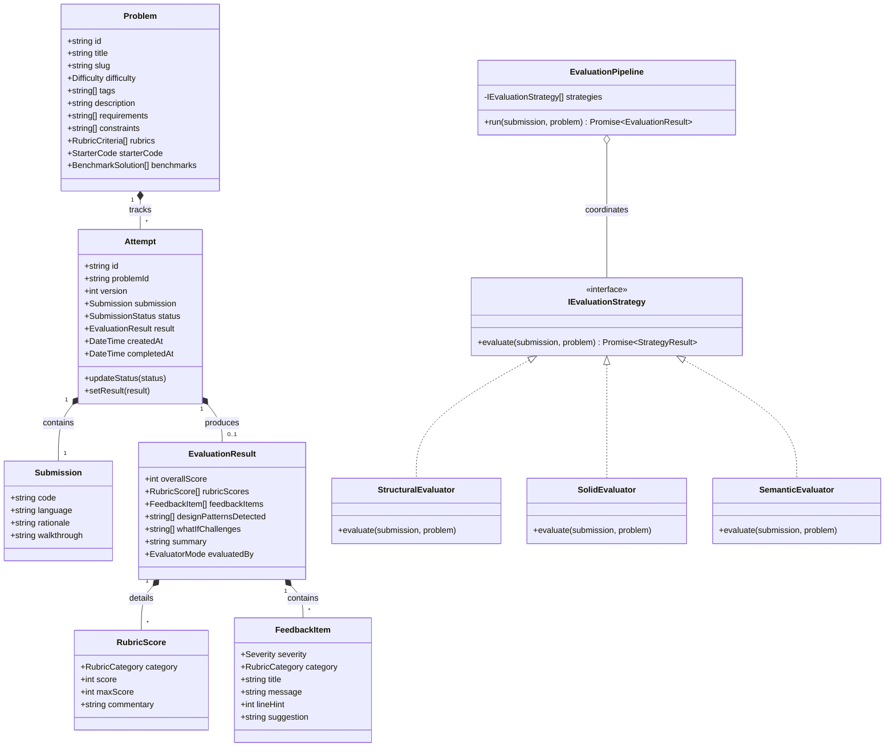

# Design Note: Low-Level Design (LLD) Platform Architecture & Domain Model

**Project**: LLD Practice Platform  
**Author**: Engineering Team  
**Date**: September 2026  
**Scope**: MVP Architecture, Domain Model, Evaluation Pipeline & Engineering Decisions

---

## 1. System Vision & The Learner Journey

The primary goal of the LLD Practice Platform is to provide a focused, low-friction, high-fidelity practice loop for engineers sharpening their object-oriented and low-level system design skills.

### The 5-Stage Practice Loop
```
  [1. Explore & Select] ──> [2. Ideate & Author] ──> [3. Submit & Validate]
            ▲                                                 │
            │                                                 ▼
  [5. Reflect & Compare] <─────────────────────── [4. Explainable Feedback]
```
1. **Explore & Select**: Learner browses canonical problems (Parking Lot, Elevator Dispatcher, Vending Machine, Splitwise) with explicit functional requirements, constraints, and evaluation rubrics.
2. **Ideate & Author**: In a split-pane studio, the learner writes clean class and interface definitions in an editor, accompanied by a design rationale notes pane. An interactive Mermaid.js class diagram updates live to provide immediate visual feedback of object relationships.
3. **Submit & Validate**: Upon clicking submit, the submission enters an asynchronous evaluation state machine (`PENDING` $\to$ `VALIDATING` $\to$ `ANALYZING` $\to$ `SYNTHESIZING` $\to$ `COMPLETED`).
4. **Explainable Feedback**: Learner receives a multi-dimensional scorecard across 4 rubrics, line-level code suggestions, a SOLID compliance breakdown, and "What-If" architectural challenge prompts.
5. **Reflect & Compare**: Learner inspects historical attempts, tracks score improvements, and diffs code across versions before initiating the next iteration.

---

## 2. Answers to the Core Design Questions

### Q1: What does a learner actually need to provide for an LLD attempt to be meaningful?
Raw executable code alone is insufficient for LLD, because code without context hides the candidate's design intent. Conversely, a pure hand-drawn diagram lacks enforceable contracts. 

A meaningful LLD attempt requires a **Structured Tri-Part Submission**:
1. **Core Domain Contracts (Code Skeleton / Implementation)**:
   - Explicit Class and Interface declarations.
   - Field declarations with types and visibility modifiers.
   - Method signatures with parameter types and return contracts.
   - Key method bodies showing object collaboration (e.g., how `ParkingLot` delegates to `SpotAllocationStrategy`).
2. **Design Rationale & Trade-offs (Structured Notes)**:
   - Why specific patterns were selected (e.g., *Strategy* for dynamic fee calculation vs. *State* for lifecycle).
   - Assumptions regarding concurrency, scale, and boundary limits.
3. **Collaborative Flow / Usage Walkthrough**:
   - A short simulation snippet (e.g., `main()` or test case) illustrating how callers interact with the API boundaries.

### Q2: What makes feedback useful when there can be more than one valid LLD solution?
In LLD, there is never a single "canonical" answer. A Parking Lot can legitimately use a *Strategy Pattern* for spots, a *Factory Pattern* for vehicles, or a *Publisher-Subscriber* pattern for space telemetry.

Feedback is only useful if it is:
1. **Decoupled from Exact Naming & Style Bias**: Never penalize a learner because they named a class `ParkingFloor` instead of `ParkingLevel`.
2. **Evaluated Against Universal Design Rubrics**:
   - **Requirements Completeness**: Are all domain capabilities accounted for?
   - **SOLID Principles**: Are responsibilities split? Can behaviors be swapped without class modification (OCP)? Are dependencies inverted (DIP)?
   - **Coupling & Cohesion**: Are concrete classes directly instantiating dependencies (`new HourlyRateCalculator()`), or are they passed via constructor injection?
   - **Edge Cases & State Invariants**: What happens when the lot is full? Are null or invalid tickets defended against?
3. **Constructive & Socratic**:
   - State the **Consequence**: *"Because `ParkingLot` directly calculates fees, adding weekend rates requires modifying the core lot orchestration class."*
   - Give the **Refactoring Nudge**: *"Extract `IFeeCalculationStrategy` and inject it into `TicketService`."*
   - Offer a **"What-If" Stress Test**: *"What if the lot introduces dynamic surge pricing during peak hours?"*

### Q3: Which parts of evaluation should be deterministic, and which parts benefit from an LLM?

```
+---------------------------------------------------------------------------------+
|                       Evaluation Pipeline Architecture                          |
+---------------------------------------------------------------------------------+
|  Stage 1: Deterministic Engine (Fast, 100% Consistent, Offline AST Analysis)    |
|  - Parse AST (classes, interfaces, methods, parameters, inheritance)            |
|  - Entity Completeness: Check presence of core domain nouns                     |
|  - God Class Detection: Flag classes with method count > threshold (> 8 methods)|
|  - Coupling Inspection: Detect direct `new` instantiations inside methods (DIP) |
|  - Inheritance Depth: Check against brittle deep hierarchies                    |
+---------------------------------------------------------------------------------+
                                      │
                                      ▼
+---------------------------------------------------------------------------------+
|  Stage 2: Semantic LLM Reasoning (Qualitative, Context-Aware, Trade-Offs)       |
|  - Evaluate learner's Design Rationale vs. their actual code structure          |
|  - Assess appropriateness of chosen design patterns                             |
|  - Generate tailored "What-If" architectural scenarios                          |
|  - Provide empathetic, senior-staff level prose feedback                        |
+---------------------------------------------------------------------------------+
                                      │
                                      ▼
+---------------------------------------------------------------------------------+
|  Stage 3: Feedback Synthesizer & Fallback Guard                                 |
|  - Combine deterministic metrics and semantic insights into a unified report   |
|  - IF LLM is slow (> 8s), unconfigured, or fails -> Deterministic Fallback     |
|    Heuristic Engine completes evaluation instantly with deep offline rules!    |
+---------------------------------------------------------------------------------+
```

### Q4: How does the design accommodate another evaluation approach or submission format later?
The backend employs classic Gang of Four (GoF) design patterns to guarantee extensibility:

1. **Strategy Pattern (`IEvaluationStrategy`)**:
   - Multiple evaluator strategies (`StructuralEvaluator`, `SolidEvaluator`, `LlmSemanticEvaluator`, `ContractTestEvaluator`) adhere to a common interface. Adding a new evaluator (e.g., a dynamic Docker-based test runner or a security linter) requires writing a new class implementing `IEvaluationStrategy` and registering it in the pipeline without touching existing evaluators.
2. **Adapter Pattern (`ISubmissionAdapter`)**:
   - Today's submissions are Python/TypeScript code and rationale. Tomorrow's submissions could be UML PlantUML text, JSON class specifications, or Mermaid diagrams. An adapter normalizes any input format into a canonical `DomainModelRepresentation`.
3. **Pipeline Pattern (`EvaluationPipeline`)**:
   - Orchestrates stages sequentially or concurrently, collecting results into a composite `EvaluationResult`.
4. **Observer / Event Bus (`DomainEventBus`)**:
   - Publishes events (`AttemptSubmitted`, `EvaluationProgress`, `AttemptCompleted`). WebSockets, analytics listeners, or email dispatchers can subscribe independently.

### Q5: What should happen if evaluation takes time or fails?
1. **Asynchronous Non-Blocking Processing**:
   - Submissions immediately return HTTP 202 with an `attemptId` and initial status `PENDING`.
   - The UI polls or receives live status updates with an animated progress stepper, avoiding gateway timeouts.
2. **Circuit Breaker & Timeout Guard**:
   - External LLM calls are wrapped in an `AbortSignal` with a strict 8-second timeout.
3. **Graceful Degradation (Fallback Engine)**:
   - If an external call fails, times out, or no API key is provided, the platform automatically triggers the `DeterministicFallbackEvaluator`.
   - The learner still receives a high-quality, rubric-grounded feedback report enriched with AST rule findings, accompanied by a polite system notice (*"Evaluated using High-Fidelity Heuristic Rule Engine"*). The system **never hangs or crashes**.

---

## 3. Class & Domain Model Architecture

The domain layer is decoupled from web frameworks and storage mechanisms, following clean hexagonal / domain-driven design principles.



### Class Responsibilities
- **`Problem`**: Holds problem specifications, required entities, constraints, and benchmark solutions.
- **`Attempt`**: Manages the lifecycle of a learner's submission, tracking versioning, status transitions, and evaluation outputs.
- **`Submission`**: Value object encapsulating source code, rationale text, and execution walkthrough.
- **`EvaluationResult` & `RubricScore`**: Value objects holding normalized scores (0–100), itemized feedback, and architectural challenges.
- **`EvaluationPipeline`**: Orchestrator executing registered evaluation strategies in sequence, managing timeouts and synthesizing the final report.
- **`IAttemptRepository`**: Repository abstraction for storing and retrieving problem attempts by ID or problem slug.

---

## 4. Key Architectural Trade-offs

| Decision | Chosen Option | Alternative Considered | Rationale & Trade-off |
| :--- | :--- | :--- | :--- |
| **System Boundary** | Single Monolithic Process (Express API + Vite SPA) | Microservices with Kafka & Redis Queue | For a 2-day LLD prototype, an in-process async worker avoids distributed systems overhead (Kafka, Redis, ZooKeeper) while keeping code strictly modular and clean. |
| **Storage Engine** | Thread-safe In-Memory Repository with Seed Data | Postgres / Prisma ORM | Allows instant zero-setup execution by any reviewer with `npm start`, avoiding external database setup hurdles while adhering to repository patterns. |
| **Evaluation Hybrid** | Deterministic AST + Semantic LLM with Automatic Fallback | Pure LLM Prompts | Pure LLM is non-deterministic, prone to hallucinations, and fails if API keys are missing. AST heuristics guarantee fast, consistent baseline metrics every single run. |
| **Live UML Diagram** | Client-side dynamic Mermaid.js generation from code AST | Server-side PlantUML rendering to PNG | Zero server latency, instant visual feedback as the user types, and no server-side Java/Graphviz dependency. |

---

## 5. Summary

This design emphasizes **clarity, extensibility, and learner-centric feedback**. It delivers a production-grade domain architecture that satisfies both the immediate prototype requirements and provides a clean runway for future multi-language compilation, live peer review, and automated Docker sandbox execution.
